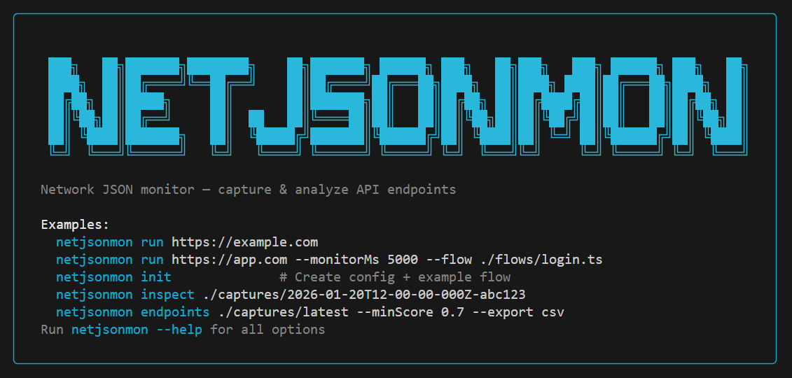

# netjsonmon

A CLI tool to monitor and capture JSON network responses during browser sessions using Playwright.



## Quick Start

If you need help installing Node.js and npm, see `docs/SETUP.md`.

```bash
npm install
npm run build
npm link

netjsonmon
netjsonmon run https://example.com
```

Captures are saved under `./captures/<timestamp>-<runId>/`.

## Basic Usage

```bash
netjsonmon run https://jsonplaceholder.typicode.com/users
```

Common options:

```bash
netjsonmon run https://jsonplaceholder.typicode.com/users --monitorMs 5000 --outDir ./captures
```

## What You Get

- Deterministic capture window with JSON-only filtering.
- Safe storage with redaction of common secrets and PII.
- Endpoint summary and scoring to highlight likely data APIs.

## Advanced Usage

### Commands

- `netjsonmon` shows the welcome banner and examples.
- `netjsonmon run <url>` captures JSON responses.
- `netjsonmon init` creates a config file and sample flow.
- `netjsonmon inspect <captureDir>` shows a summary for a previous run.
- `netjsonmon endpoints <captureDir>` filters and exports endpoints.
- `netjsonmon label <captureDir>` manually labels endpoints and exports training data.

### Run Options

- `<url>` - URL to monitor (required)
- `--headless` - Run browser in headless mode (default: true)
- `--monitorMs <ms>` - Capture window duration (default: 10000)
- `--timeoutMs <ms>` - Hard timeout for entire operation, including capture finalization (default: 30000)
- `--outDir <dir>` - Output directory (default: ./captures)
- `--includeRegex <pattern>` - Only capture URLs matching this regex
- `--excludeRegex <pattern>` - Exclude URLs matching this regex
- `--maxBodyBytes <bytes>` - Maximum body size to capture (default: 1048576 = 1MB)
- `--inlineBodyBytes <bytes>` - Inline bodies smaller than this (default: 16384 = 16KB)
- `--maxCaptures <count>` - Maximum captures (default: 0 = unlimited)
- `--maxConcurrentCaptures <count>` - Maximum concurrent capture operations (default: 6)
- `--captureAllJson` - Capture JSON from all resource types (default: false)
- `--flow <path>` - Path to custom flow module
- `--saveHar` - Save HAR file for debugging (default: false)
- `--trace` - Save Playwright trace for debugging (default: false)
- `--userAgent <string>` - Custom user agent
- `--consentMode <mode>` - Consent handling: auto, off, yahoo, generic (default: auto)
- `--consentAction <action>` - Consent action preference: reject or accept (default: reject)
- `--consentHandlers <list>` - Comma-separated handlers to enable (default: all)
- `--storageState <path>` - Load browser storage state (cookies, localStorage) from file
- `--saveStorageState` - Save browser storage state after flow (default: false)
- `--disableSummary` - Disable automatic summary generation (default: false)
- `--quiet` - Suppress non-essential output (default: false)
- `--verbose` - Show verbose progress information (default: false)
- `--debug` - Show debug information (default: false)
- `--json` - Output results as JSON (default: false)
- `--open` - Open capture directory after completion (default: false)

### Handling Consent Pages

Many sites show privacy/consent interstitials before the main content. netjsonmon provides several ways to handle these:

```bash
# Auto-handle Yahoo consent (clicks "Reject all")
netjsonmon run https://ca.finance.yahoo.com/quote/AAPL --consentMode yahoo

# Use generic consent handler for other sites
netjsonmon run https://example.com --consentMode generic
```

Default action is `reject` for better repeatability. You can override with:

```bash
netjsonmon run https://example.com --consentMode generic --consentAction accept
```

### Custom Flows

Create a custom flow to interact with the page:

```typescript
// flows/login.ts
export default async (page) => {
  await page.click('#login-button');
  await page.fill('#username', 'test@example.com');
  await page.fill('#password', 'password');
  await page.click('#submit');
  await page.waitForSelector('#dashboard');
};
```

Run with:

```bash
netjsonmon run https://example.com --flow ./flows/login.ts
```

### Debug Artifacts

Enable trace recording:

```bash
netjsonmon run https://example.com --trace
```

View the trace:

```bash
npx playwright show-trace ./captures/<runId>/trace.zip
```

Enable HAR recording:

```bash
netjsonmon run https://example.com --saveHar
```

### Output Structure

```text
captures/
  <timestamp>-<runId>/
    run.json           # Run metadata
    index.jsonl        # One JSON record per capture
    summary.json       # Endpoint aggregation and scoring
    endpoints.jsonl    # All endpoints with metrics
    labels/
      labels.jsonl     # Manual labels per endpoint (created by label command)
      training.jsonl   # Exported features + labels (optional)
    bodies/
      <hash>.json      # Externalized response bodies
    session.har        # Optional HAR file (--saveHar)
    trace.zip          # Optional Playwright trace (--trace)

training-captures/
  <timestamp>-<runId>/ # Same structure as captures/ (tracked for collaborative labeling)
```

### Labeling Endpoints (Prompt 12)

```bash
# Interactive labeling (writes labels/labels.jsonl)
netjsonmon label ./captures/<runId>

# Export training data (features + label)
netjsonmon label ./captures/<runId> --export
```

### Shared Training Captures

For collaborative labeling, place capture folders under `training-captures/` (tracked in git):

```bash
# Label a specific capture from the pool (you'll be prompted to pick)
netjsonmon label ./training-captures

# Export training data from selected captures in the pool
netjsonmon label ./training-captures --export
```

## Development

```bash
npm run build
npm test
npm link
netjsonmon run <url>
```

## Testing

```bash
npm test
```

## Project Status

- **Main plan completed**: Prompts 1-11 in `docs/PLAN.md` are implemented, including CLI commands, capture pipeline, storage, scoring, and validation runs.
- **Validation results**: See `docs/VALIDATION_RESULTS.md` for real-world test coverage and known issues.
- **Extensions not yet implemented**: Prompts 13-14 (ML classifier, online prediction) are tracked in `docs/EXTENSIONS.md`.

## License

MIT
